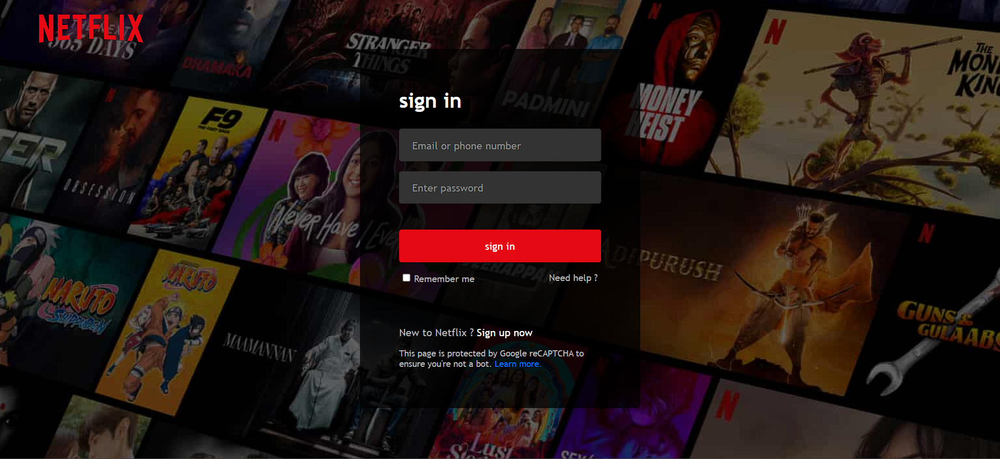

# Netflix Login Page Clone

A clone of the Netflix login page with HTML and CSS.

## Table of Contents

- [Netflix Login Page Clone](#netflix-login-page-clone)
  - [Description](#description)
  - [Preview](#preview)
  - [Technologies Used](#technologies-used)
  - [Usage](#usage)
  - [Getting Started](#getting-started)

## Description

This project is a clone of the Netflix login page, created using HTML and CSS. It replicates the appearance and functionality of the Netflix login page, allowing users to enter their email or phone number, password, and provides an option to remember the user. The project also includes links to sign up for a new Netflix account and a "Need help?" link.

## Preview

## Technologies Used

The following technologies and tools were used in this project:

- HTML
- CSS

## Usage

To use this Netflix login page clone in your project, follow these steps:

1. Clone this repository to your local machine:
2. Navigate to the project directory:
3. Open the `index.html` file in your web browser to view the Netflix login page clone.
4. You can customize the styles further by editing the `style.css` file to match your project's requirements.

## Getting Started

To get started with this project, you don't need to install any dependencies or set up a server. Simply open the `index.html` file in your web browser, and you'll be able to see the Netflix login page clone.

Feel free to use, modify, and distribute this code as needed. If you have any questions or suggestions, please feel free to [open an issue](https://github.com/yourusername/Netflix-Login-Clone/issues).

